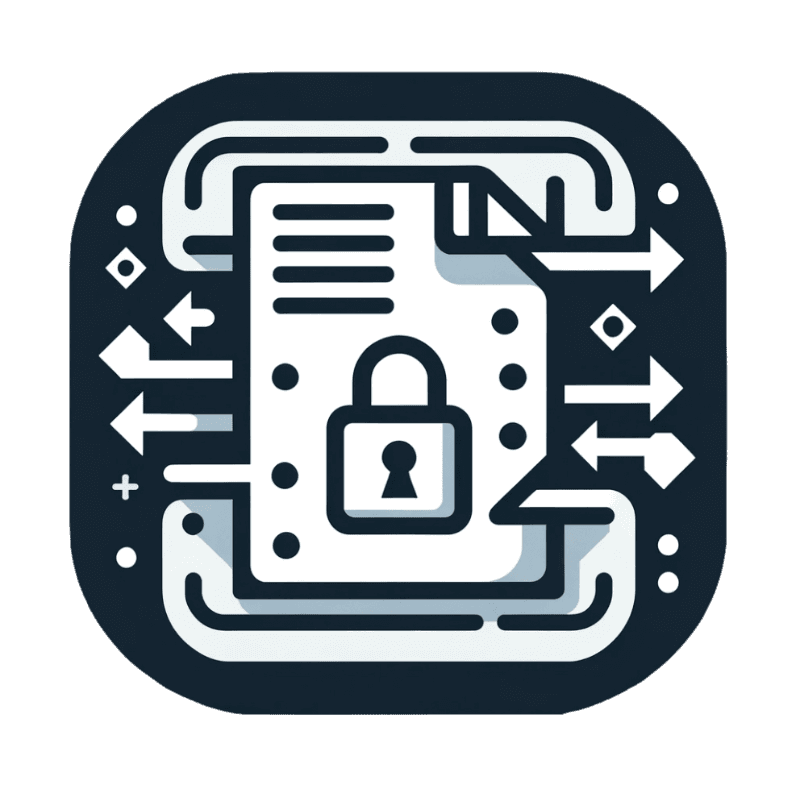
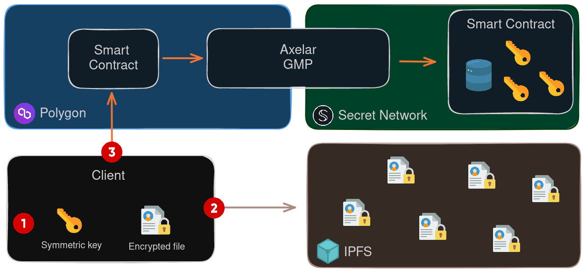

 

  

  <h3 align="center">Secret Share Documents</h3>

  

    Share confidential documents by using Secret Network - Privacy as a Service
     
    <a href="https://github.com/fifty-wei/secret-share-documents"><strong>Explore the docs »</strong></a>
     
     
    <a href="https://github.com/fifty-wei/secret-share-documents">View Demo</a>
    ·
    <a href="https://github.com/fifty-wei/secret-share-documents/issues">Report Bug</a>
    ·
    <a href="https://github.com/fifty-wei/secret-share-documents/issues">Request Feature</a>
  

## About The Project

Secret Network is introducing a groundbreaking functionality to utilize its blockchain as a service. This innovation offers new possibilities, such as the ability to execute contracts on Polygon while leveraging the privacy features of Secret Network. This approach ensures the security of a primary blockchain while harnessing the privacy capabilities of Secret Network for external computations.

We aimed to create a robust mechanism for securely sharing documents on the blockchain with specific recipients. This solution addresses a critical need for businesses and decentralized autonomous organizations (DAOs) seeking to share sensitive administrative and confidential data to a selected audience. Currently, the challenge lies in sharing documents on-chain while safeguarding the privacy of users. We firmly believe that Secret Network's cutting-edge technology can effectively address this use case by enabling individuals to share documents with the assurance of privacy and data encryption, thus redefining the way confidential information is shared within a blockchain ecosystem.

Through this project, we are providing a SDK allowing anyone to store and share confidential documents by taking advantage of the Secret Network chain while remaining on an EVM chain.  

## Architecture

Our propose approach to store confidential document on chain, rely on multiple components. First, to be able to store large document, we need solution like IPFS. However, anyone can access IPFS data. In order to store it confidentially, we need to encrypt the document. To encrypt it, we will generate locally a key allowing us to crypt and decrypt the document. Now we need another component to store those sensitive information, and this is where Secret Network comes in. On Secret Network all transactions are encrypted. Also, the state of a smart contract is also encrypted, allowing us to store sensitive information by providing restriction on user access. However, using directly Secret Network will require to use another wallet for the user. However, we want to limit the friction for the end user. Thus instead of using direclty Secret Network, we can use a classical request on a EVM chain and use Secret As A Service. 

The idea behind Secret As A Service, is to keep a classical EVM architecture, which means having a contract, for instance on Polygon, but using Secret Network when we need to store sensitive information. Instead of calling directly from the client browser, we will call it on the EVM chain. This allows the user to keep the interaction on a single chain. The Smart contract on Polygon, will then managed all the process. It will call Axelar, that will bridge the message from the Polygon chain to the Secret Network chain, allowing to store confidential information.

  

On the diagram, we can saw the different components. On the use case for storing a document, a user will first have a document he wants to store on blockchain. He will first locally generate a symmetric key [1] allowing him to encrypt the document. The encrypted document is then store on IPFS and he will get a link to it [2]. Then, the user will prepare a payload to store sensitive information on Secret Network. This payload will contain the link to IPFS and the symmetric key used to encrypt the document. This payload will then be encrypted using the public key of the smart contract on Secret Network. Notice that this interaction is seamless for the user as it is a query request, no wallet are required. Also, notice that we encrypt the payload, as on a EVM chain, any transaction can be seen. However, here we only want the Secret Smart Contract to see the user request.

Once the payload encrypted, the user send a transaction on Polygon [3]. The smart contract on Polygon, can do additional process regarding the user request (it is customizable) and then send the payload to Axelar. Axelar transfer the payload from Polygon to Secret Network and send it to the Secret Smart Contract where it will be process. The Secret Smart Contract decrypt the payload of the user, and store the sensitive information on the Smart Contract. Finally, is the user wants to retrive the data, he can query the Secret Smart Contract, obatin an id of the stored file and then retrieve the file information.

### Features

In this project, we proposed a SDK allowing you to store and share confidential documents. By using our SDK, you will have the possibility to:
- Store a new document
- See the content of this document
- Grant/Revoke the access to the document to another person

When using our SDK, you will have the possibility to use an EVM account. When using it, through Metamask for instance, it will generate a new secret account linked to your EVM account. So, each time you connect to your Metasmask, you will keep the same secret account, enabling you to retrieve your confidential documents. Note that when you want to share a document with someone else, you need to provide the secret address of the person you want to share it with. 

> Limitation: In our SDK, we currently do not manage file editing. Additionally, when sharing a document to someone else, that person could still have access to the file, even if you revoke his access. Indeed, as we are using a IPFS storage to store the document, we cannot delete it. Thus, if the person makes a copy the symmetric key used to encrypt the document when he first has access to the encrypted data, even if you revoke the access later on, that person can still have access to the file.

## Getting Started

This project is decomposed in sevaral components:

- `contract`: The Secret Network smart contract, that will be deploy on the Secret Network chain, allowing user to store confidential data.
- `polygon-secret`: The EVM implementation to send a message to Axelar GMP.
- `sdk-js`: The SDK implementation, allowing you to interact with all the component.
- `front`: An example use case to store confidential document.

### Deploy your own contract

In the `contract` folder, you will find the source code of our smart contract used to store confidential information and a script to deploy yours.

For testing purpose, we have deploy a smart contract on `pulsar-3` testnet of Secret Network. Here the contract address: `secret14tplljk8wjezkya2jcx2ynjx5udue8uj69f75q`. And we also deploy it on mainnet to test the Axelar implementation. You can find the contract deployed on the secret mainnet at this address: `secret10k9kpudxcan09p55lzy8er3rm6u2sp7cswdcg3`.

## Contact

- Regis G : https://www.linkedin.com/in/regis-graptin/
- Florian T : https://www.linkedin.com/in/floriantruchot/
- Martin L : https://www.linkedin.com/in/leclercqmartin/

Team website : https://www.fiftywei.co/

This work was realized in collaboration with Secret Network.

